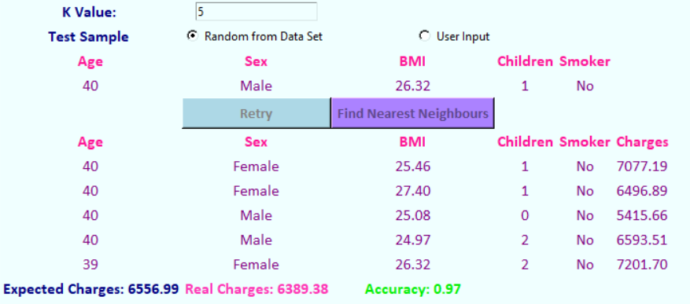

# Regression with K-Nearest Neighbours

In this project I will be implenting the K Nearest Neighbours Algorithm in Python. I used an Insurance dataset from Kaggle. In this data, we have age, sex, bmi, number of childs, smoker-non smoker, region, charges rows. With KNN, we try to predict the charges with the help of the other rows. So, the dataset splitted 80%-20% as training and testing. 

For KNN, I did not use SciPy library, I coded the KNN part by myself. When finding distance between the elements of dataset, I used Euclidean Distance. 

I made a simple GUI with Tkinter. 

  

User selects the K value. User is able to select a random sample from dataset or create a new sample by herself/himself. When press the find nearest neigbours button, K nearest neigbours shows. If user select the random sample from dataset, accuracy calculates. In the below we can see the expected and predicted charges and the accuracy.

I've done some experiments to increase the accuracy of the overall system. My goal was the finding the best K value for a task. 

## Experiment 1

Distance between the non-smokers and smokers is 1. Distance between the females and males is 1.

  

K values changed between 1 and 20. When K value is 3, the accuracy is 34%. When the K value increases the accuracy decreases after the K = 3 value. This result is poor and needed to be improve.

## Experiment 2

When we compare the smokers and the non-smokers differences between the charges are dramatic. So, distance between the smoker region as 1 is not enough. In this experiment, the distance between the smokers and the non-smokers boost to the 3.

  

Accuracy is around 60% when the K value is between 3 and 8. So, the accuracy improved very well.

## Experiement 3

  

As a result, accuracy is above 58% when K values is between 4 and 12. This result is more tolerant to the different K values. So, the settings of the system are settled with respect to Experiment 3.
